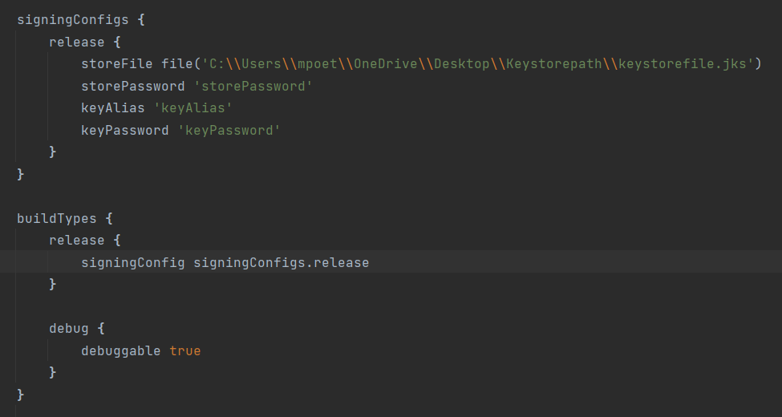
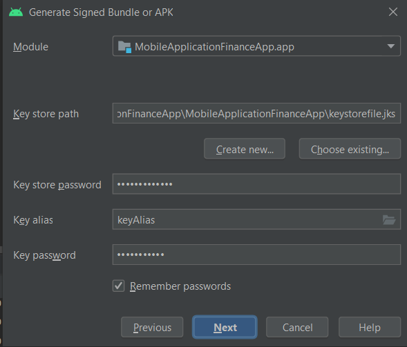
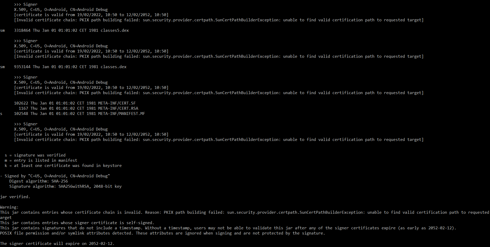
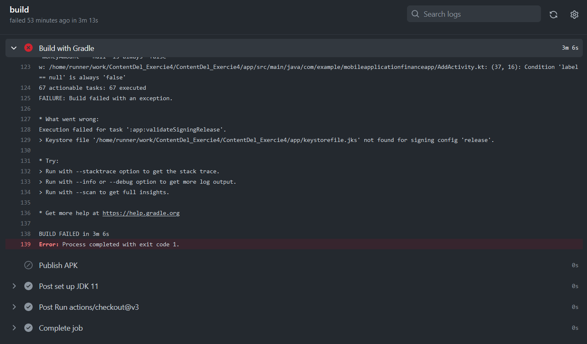

# Exercise FinanceApp Exercise 4

Tried to make everystep like it is in the guide.

GradleBuild

Creating the key

after the command Signatur jarsigner -verify -verbose -certs my_application.apk was a problem that it looked diffrent than in the guide but it had sm everywhere so that the signature is verifyied.

Failed the Gradlebuild havent figued it out how to fix it is most certanly because of the wrong keystorepath was wrong.

